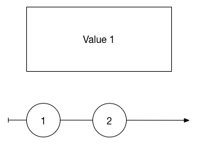
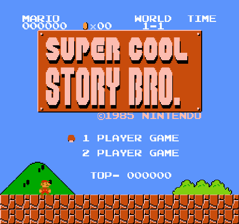

autoscale: true
slidenumbers: true

# _State_ of Emergency: 
## How Functional Reactive Programming Can Help You Write More Stable iOS Apps

Michael McGuire
`@MonocularVision`

---

# [fit] State?

^ What is state?  Isn't it what programming is?  Isn't it the source of our power? When most developers think of state, we think this...

---

^ But we're really this...

---

^ Issue with state is really specifically over shared mutable state

---

# [fit] Example

^ Demo app, 2.5 hours (to get right)

---

# State of Example App

* Top text valid (>= 3 characters)
* Bottom text valid (>= 4 characters)
* Generate enabled
* Cancel enabled
* Network request in progress
* Network request cancel token
* Network activity indicator view hidden
* UIImage view hidden

2 ^ 8 = __*256 possible states*__

^ How do we deal with this? In the example app, try to limit places where state is updated to single method `updateUI` but is called from _5_ places

---

# [fit] Functional 
# [fit] Programming

^ Simplified model of programming, only deals with inputs and outputs.  For any given input, the same output must occur.
^ Scheme, Haskell

---

^ Very trendy, gaining traction in Swift because of language features & syntax

---

# [fit] But what about
# [fit] UI?

^ UI and IO has state, how do we deal with that in functional programming?

---

# [fit] Functional
# [fit] Reactive
# [fit] Programming

---

# [fit] State 
# [fit] =
# [fit] Values Over Time

^ Think of the state as being a timeline, instead of a box

--- 

---

# Terminology

* Observable (RxJava, Reactive Extensions - .NET)
* Behaviors (Haskell)
* Signals (Elm, ReactiveCocoa)

---

# ReactiveCocoa Types

* `Signal`
* `SignalProducer`
* `Property`
* `Action`

---

# [fit] Signal

^ Playground example

---

# [fit] SignalProducer

^ Issues with Signal: can start sending messages as soon as it is created, what if we haven't subscribed yet?  Also, what about side-effects?  Imagine a network request or a file load.  Does observing the signal start it?

^ This is the major differentiation between ReactiveCocoa and many other Reactive frameworks, separation of the "Hot" and "Cold" signal/observable

^ Playground example

---

# Signal vs SignalProducer

`Signal`s are a "live" and continuous stream of `Event`s that are sent when they occur.  Any subscribers will see those events as they happen in the same order.

`SignalProducer`s represent a "recipe" for creating a signal and must be explicitly started.  Each call to `start[...]` creates a new `Signal` and only the observers of that `Signal` will see the events.

---

# So? 

--- 

# Operators

Operators are functions that transform the event streams emitted by `Signal`s and `SignalProducer`s.  

^ Operators are the real power behind ReactiveCocoa

^ Playground example

---

# [fit] Example 
# [fit] \(Rewritten)

---

# Caveats

* ReactiveCocoa 4.0 is still in alpha
* Most RAC extensions on UIKit and Foundation not ported over yet
* Using the debugger can be .... difficult

^ If time, demonstrate breakpoint inside of signal operator

---

# In Conclusion...

* Shared mutable state is difficult
* Treating mutable state as changing values over time can simplify code
* Give ReactiveCocoa a try!

---

# [fit] Questions?

Michael.McGuire@gmail.com
@MonocularVision
[https://github.com/MichaelMcGuire/MemeGenerator](https://github.com/MichaelMcGuire/MemeGenerator)